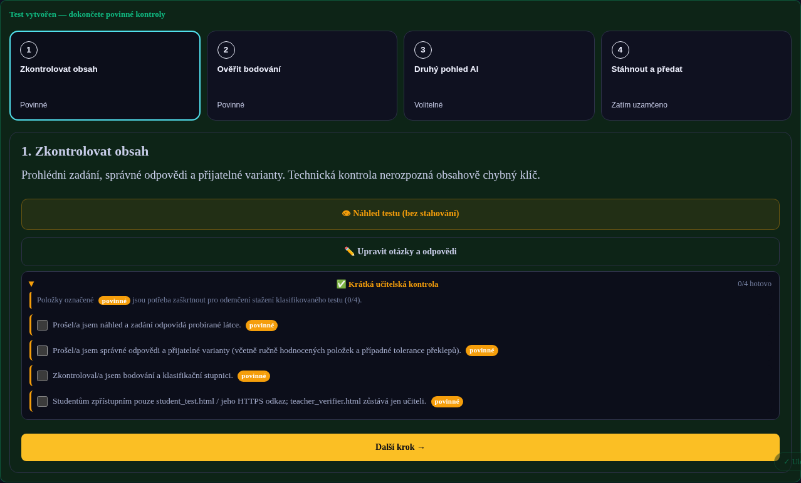
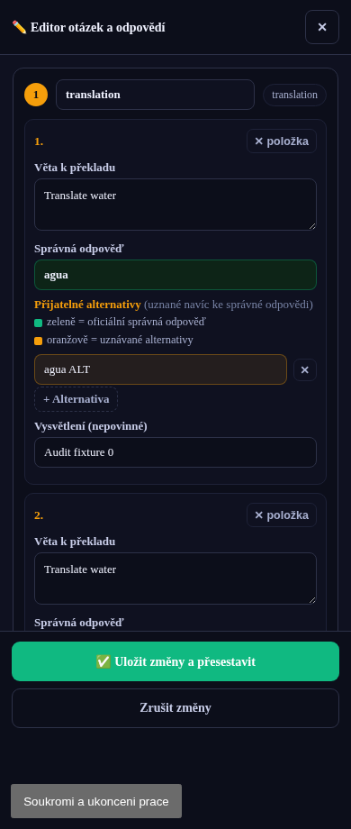

# Generátor interaktivních testů 7.1.46
## Závěrečný lokální funkční audit a přehled oprav

**Datum:** 21. 9. 2026. **Rozsah:** jednoduchý i pokročilý režim, všech 38 nabízených jazykových typů, samostatný český modul, studentské testy a učitelské nástroje. Vychází z dodaného archivu `generator-testu-main(20260921-063920).zip` a devíti navazujících opravených souborů z této konverzace.

**Verdikt:** upravená verze prošla níže vymezeným lokálním auditem. Balíček obsahuje celý projekt, sestavený náhled, reprodukovatelné testy, zdrojový patch a důkazy. **NENÍ to potvrzení ostrého nasazení ani záruka správnosti každé odpovědi AI.** U vydání je `sourceAuditPending: true`; exporty jsou označené `source-audit-candidate`.

## 1. Co znamená „všechny kombinace“

Testovány jsou všechny položky katalogu, všechny dvojice typů, stanovené rozsahy počtů a konečná matice důležitých přepínačů. Libovolný text zadání, délka zdrojů a nedeterministické odpovědi modelu nemají konečný vyčerpatelný počet možností. Výsledky proto neslučuji do tvrzení „každý myslitelný test funguje“.

Klikací scénáře používají skutečné ovládací prvky v Chromium: volbu typu, tlačítko generování, formuláře, odpovědi, odevzdání a import do ověřovače. Nastavení výchozích podmínek a některé konfigurační kontroly jsou programové, nikoli proklikání každého pole. Odpověď poskytovatele AI je nahrazena řízenými testovacími daty. Tím se prověřuje aplikace kolem AI, nikoli jazyková nebo didaktická kvalita modelu.

| Oblast | Scénáře | Výsledek | Důkaz |
|---|---:|---|---|
| Průchod generováním: 38 typů × 5 jazyků × 2 režimy | 380 | PROŠLO | `pipeline-matrix.json` |
| Studentské vyplnění a odevzdání: 48 smíšených balíčků, 456 kombinací typ/jazyk/režim | 48 | PROŠLO | `browser-matrix.json` |
| Editace všech 38 položek v obou režimech | 76 | PROŠLO | `editor-suite.json` |
| Jednoduchý průvodce a návrat z pokročilého | 16 | PROŠLO | `wizard-suite.json` |
| Český modul: vstup, 24 voleb, 13 předvoleb, limit | 39 | PROŠLO | `czech-suite.json` |
| Všech devět specializovaných ručních formulářů | 9 | PROŠLO | `manual-suite.json` |
| Editor, návrhy, druhý průchod, varianty, brána exportu | 15 | PROŠLO | `feature-suite.json` |
| Ruční + AI, skupiny, selhání, zrušení, opakování, osm cvičení | 17 | PROŠLO | `integration-suite.json` |
| Normalizované kombinace režimů při vyplňování | 36 | PROŠLO | `runtime-suite.json` |
| Jazyk rozhraní a hraniční případy textového hodnocení | 53 | PROŠLO | `language-suite.json` |
| Maximální plánovaný rozsah 21 mechanismů × 1/2/3 skupiny | 63 | PROŠLO | `stress-suite.json` |
| Identity, učitelský kód, duplicity, poškozené výsledky, žolík, čas | 8 | PROŠLO | `identity-suite.json` |
| CEFR, body, vlastní stupnice, neaktivní zdroj | 301 | PROŠLO | `config-extra-suite.json` |
| Podpůrná opatření a předání do Google Forms | 12 | PROŠLO | `accessibility-forms-suite.json` |
| Rozložení a překrytí: 1400/768/390/320 px | 4 | PROŠLO | `visual-suite.json` |

**Další vyčerpané konfigurační matice:** 576 normalizací režimů včetně opakované aplikace; 1 482 kontraktů dvojic typů (741 dvojic včetně shodných typů, pro jednu a tři skupiny); 3 420 hranic rozsahu (38 typů × počty 1–30 × 1/2/3 skupiny). Podpůrná opatření zahrnují 360 kombinací čas/písmo/čitelnost napříč jazyky a oběma runtime. Tyto počty nejsou počty nezávislých skutečných volání AI.

**Technické kontroly:** 17 samostatných statických/regresních kontrol, 81 kontrol bezpečnostní sady GARP a `garp25:prep-static` prošly. Plné `npm test` se zastavilo na chybějícím balíčku `jsdom`; za úspěšné ho nepovažuji.

## 2. Jednoduchý režim

Prošel průchod od volby jazyka přes účel a zadání po generování: pět cizích jazyků × procvičování, běžný a přísný test. Při návratu z pokročilého režimu se vyžádá potvrzení a nekompatibilní pokročilé volby se resetují. Zrušení dialogu ponechá původní stav. Tím se omezuje případ, kdy uživatel nevidí nastavení, které stále ovlivňuje výsledek.

Generování uzamyká konfigurační vstupy, ale umožňuje zrušení. Po chybě nebo zrušení lze pokus opakovat. Neúspěšné přegenerování nezničí již hotový test. Před generováním je vidět plánovaný rozsah a počet AI požadavků.

**Co je didakticky podobné:** předvolby procvičování/domácí práce nejsou samostatné hodnoticí mechanismy. Název pomáhá s volbou výchozích nastavení, ale neměl by slibovat jinou technologii hodnocení.

## 3. Pokročilý režim a logika kombinací

Prověřeno bylo nastavení jednotlivých cvičení, 1–999 celočíselných bodů, úrovně A1–C2 včetně 63 neprázdných kombinací, vlastní klasifikační stupnice, diferenciace, podpůrná opatření, promíchávání, oba layouty, zpětná vazba a odevzdávání. Body se nemají samovolně přerozdělit při nesouvisející změně.

| Volba | Vynucené nebo ověřené chování |
|---|---|
| Přísný test + okamžité vyhodnocení | Přepne se na bezpečný offline režim a odevzdání celku. |
| Procvičování + bezpečný offline | Procvičování použije okamžitou výukovou zpětnou vazbu. |
| Bezpečný offline + po cvičeních | Odevzdání celého testu. |
| Bez zpětné vazby + po cvičeních | Odevzdání celého testu. |
| Diferenciace + jednoduchý režim | Přechod do pokročilého režimu. |
| Diferenciace + změna počtu položek v editoru | Operace jsou omezeny, aby se nerozešel rozsah skupin. |
| Ruční + AI | Ruční část je vložena na správné místo; ostatní části se generují zvlášť. |
| Zrušit ruční formulář | Výslovně odlišeno nahrazení AI od zrušení celého generování. |
| Vlastní stupnice | Mezera nebo překryv intervalů brání pokračování. |
| Neaktivní záložka zdrojů | Stará URL nebo soubor neplatí jako aktuální podklad pro poslech. |

**Důležitý rozdíl:** tlačítko pro další variantu vytvoří nové ID a promíchanou variantu existujícího testu. Není to automaticky nový obsah vytvořený AI. Diferenciace naopak pracuje s odděleným obsahem skupin. Opravil jsem variantu, která mohla převzít později změněné nastavení formuláře. Nyní používá uložené nastavení původního výstupu, aktualizuje integritu a zneplatní předchozí kontroly.

## 4. Jazyky

Funkční katalog cizích jazyků obsahuje angličtinu, španělštinu, němčinu, francouzštinu a latinu. Čeština má vlastní modul. **Francouzština a latina původně při cílovém jazyce padaly do českého rozhraní; doplněny jsou vlastní studentské slovníky.** Lokalizovány jsou také složitější ovládací prvky, identity a hlášení podpůrných opatření. Učitelské prostředí zůstává česky.

Volba `target` nastaví zvolený jazyk; `cs` a `mixed` mají české ovládací prvky. Smíšené instrukce se týkají zadání generovaného modelem, nikoli slibu dvojjazyčného každého tlačítka. Kontrolován je i HTML atribut `lang` a předání jazyka do promptu.

### Pravidla hodnocení, která mohou překvapit

| Případ při vypnuté toleranci překlepů | Skutečné chování |
|---|---|
| Cizí jazyky: velká písmena / běžná interpunkce | Obvykle se ignorují: `wasser` odpovídá `Wasser`, `river!` odpovídá `river`. |
| ES: `rio` / `río`, `pinguino` / `pingüino` | Polovina bodu. Toto speciální pravidlo existuje nezávisle na toleranci překlepů. |
| ES: `ano` / `año` | Neshoda; ñ není pouhý přízvuk. |
| DE: `schon` / `schön`, `strasse` / `straße` | Neshoda bez explicitní alternativy. |
| FR: `riviere` / `rivière` | Neshoda bez alternativy. |
| LA: `malum` / `mālum` | Neshoda bez alternativy; pro výuku bez délek je nutné tomu přizpůsobit klíč. |
| Unicode: složené / rozložené akcenty | Kanonicky ekvivalentní zápisy jsou uznány. |
| Čeština se zapnutou příslušnou kontrolou | Diakritika, velká písmena a interpunkce se rozlišují. |

Tyto existující politiky jsem nevyměnil za nový systém známkování bez rozhodnutí učitele. Přidal jsem jejich vysvětlení do nastavení. **Pro německá velká písmena nebo přesnou interpunkci v cizím jazyce proto automatické hodnocení nemůže sloužit jako přísný pravopisný korektor.** Překlad, parafráze a krátká otevřená odpověď se hodnotí klíčem, nikoli volným porozuměním významu.

Pro český modul prošlo všech 24 voleb a 13 předvoleb. Opraveno je uchování vlastního tématu, vazba na prompt a omezení deseti cvičení. Nadbytečný přepínač „přesný tvar“ byl nahrazen vysvětlením skutečného chování. Stylistické a interpretační úlohy vyžadují učitelskou kontrolu; automatický klíč není její náhradou.

## 5. Každé cvičení zvlášť

Následující tabulka uvádí každou volbu tak, jak ji zná aplikace. „Prošlo“ znamená ověřený datový kontrakt, vykreslení, odpovídání a hodnocení testovacího příkladu. Neznamená to ověření každé budoucí formulace AI.

| # | Nabízená položka | Mechanismus | Otestováno |
|---:|---|---|---|
| 1 | multiple choice | multiple choice | Výběr/generování EN, ES, DE, FR, LA; vyplnění navíc CS; oba režimy; editor |
| 2 | multi-select | multi-select | Výběr/generování EN, ES, DE, FR, LA; vyplnění navíc CS; oba režimy; editor |
| 3 | fill-in-the-blank | fill-in-the-blank | Výběr/generování EN, ES, DE, FR, LA; vyplnění navíc CS; oba režimy; editor |
| 4 | matching | matching | Výběr/generování EN, ES, DE, FR, LA; vyplnění navíc CS; oba režimy; editor |
| 5 | word order | word order | Výběr/generování EN, ES, DE, FR, LA; vyplnění navíc CS; oba režimy; editor |
| 6 | ordering | ordering | Výběr/generování EN, ES, DE, FR, LA; vyplnění navíc CS; oba režimy; editor |
| 7 | highlight-evidence | highlight-evidence | Výběr/generování EN, ES, DE, FR, LA; vyplnění navíc CS; oba režimy; editor |
| 8 | categorisation-board | categorisation-board | Výběr/generování EN, ES, DE, FR, LA; vyplnění navíc CS; oba režimy; editor |
| 9 | table-completion | table-completion | Výběr/generování EN, ES, DE, FR, LA; vyplnění navíc CS; oba režimy; editor |
| 10 | transformation-chain | transformation-chain | Výběr/generování EN, ES, DE, FR, LA; vyplnění navíc CS; oba režimy; editor |
| 11 | translation | translation | Výběr/generování EN, ES, DE, FR, LA; vyplnění navíc CS; oba režimy; editor |
| 12 | true/false | true/false | Výběr/generování EN, ES, DE, FR, LA; vyplnění navíc CS; oba režimy; editor |
| 13 | error correction | error correction | Výběr/generování EN, ES, DE, FR, LA; vyplnění navíc CS; oba režimy; editor |
| 14 | error-tagging | error-tagging | Výběr/generování EN, ES, DE, FR, LA; vyplnění navíc CS; oba režimy; editor |
| 15 | cloze text | cloze text | Výběr/generování EN, ES, DE, FR, LA; vyplnění navíc CS; oba režimy; editor |
| 16 | sentence transformation | sentence transformation | Výběr/generování EN, ES, DE, FR, LA; vyplnění navíc CS; oba režimy; editor |
| 17 | reading comprehension | reading comprehension | Výběr/generování EN, ES, DE, FR, LA; vyplnění navíc CS; oba režimy; editor |
| 18 | dialogue completion | dialogue completion | Výběr/generování EN, ES, DE, FR, LA; vyplnění navíc CS; oba režimy; editor |
| 19 | categorization | categorization | Výběr/generování EN, ES, DE, FR, LA; vyplnění navíc CS; oba režimy; editor |
| 20 | word formation | word formation | Výběr/generování EN, ES, DE, FR, LA; vyplnění navíc CS; oba režimy; editor |
| 21 | listening comprehension | listening comprehension | Výběr/generování EN, ES, DE, FR, LA; vyplnění navíc CS; oba režimy; editor |
| 22 | odd one out | multiple choice | Výběr/generování EN, ES, DE, FR, LA; vyplnění navíc CS; oba režimy; editor |
| 23 | multiple matching | matching | Výběr/generování EN, ES, DE, FR, LA; vyplnění navíc CS; oba režimy; editor |
| 24 | banked cloze | cloze text | Výběr/generování EN, ES, DE, FR, LA; vyplnění navíc CS; oba režimy; editor |
| 25 | key word transformation | sentence transformation | Výběr/generování EN, ES, DE, FR, LA; vyplnění navíc CS; oba režimy; editor |
| 26 | synonym choice | multiple choice | Výběr/generování EN, ES, DE, FR, LA; vyplnění navíc CS; oba režimy; editor |
| 27 | antonym choice | multiple choice | Výběr/generování EN, ES, DE, FR, LA; vyplnění navíc CS; oba režimy; editor |
| 28 | choose the correct response | multiple choice | Výběr/generování EN, ES, DE, FR, LA; vyplnění navíc CS; oba režimy; editor |
| 29 | match word to definition | matching | Výběr/generování EN, ES, DE, FR, LA; vyplnění navíc CS; oba režimy; editor |
| 30 | verb form | fill-in-the-blank | Výběr/generování EN, ES, DE, FR, LA; vyplnění navíc CS; oba režimy; editor |
| 31 | preposition gap-fill | fill-in-the-blank | Výběr/generování EN, ES, DE, FR, LA; vyplnění navíc CS; oba režimy; editor |
| 32 | question formation | sentence transformation | Výběr/generování EN, ES, DE, FR, LA; vyplnění navíc CS; oba režimy; editor |
| 33 | word family | word formation | Výběr/generování EN, ES, DE, FR, LA; vyplnění navíc CS; oba režimy; editor |
| 34 | short answer | fill-in-the-blank | Výběr/generování EN, ES, DE, FR, LA; vyplnění navíc CS; oba režimy; editor |
| 35 | paraphrase the sentence | sentence transformation | Výběr/generování EN, ES, DE, FR, LA; vyplnění navíc CS; oba režimy; editor |
| 36 | heading matching | matching | Výběr/generování EN, ES, DE, FR, LA; vyplnění navíc CS; oba režimy; editor |
| 37 | gist question | multiple choice | Výběr/generování EN, ES, DE, FR, LA; vyplnění navíc CS; oba režimy; editor |
| 38 | summary cloze | cloze text | Výběr/generování EN, ES, DE, FR, LA; vyplnění navíc CS; oba režimy; editor |

### Výsledky 21 mechanismů

| Mechanismus | Výsledek a podstatné omezení |
|---|---|
| multiple choice | Prošlo. Jedna volba; validace indexu a neprázdných možností. |
| multi-select | Prošlo. Přesná množina správných voleb; volba navíc není plný bod. |
| fill-in-the-blank | Prošlo. Mezery a odpovědi musí mít shodnou strukturu. Alternativy nejsou další mezery. |
| matching | Prošlo. Nejméně dva páry; prázdné nebo nejednoznačné páry jsou riziko. |
| word order | Prošlo. Slova jsou nápověda, výsledek student napíše jako větu. |
| ordering | Prošlo. Skutečné klikání do pořadí. Opraveno ztrácení volby a body za prázdnou odpověď. |
| highlight-evidence | Prošlo. Výběr důkazní věty; prázdná volba není index 0. |
| categorisation-board | Prošlo. Jeden složený blok s více tříděnými položkami; nikoli 30 samostatných tabulí. |
| table-completion | Prošlo. Pevné a doplňované buňky, klíče a alternativy; opraven ruční formulář i editor. |
| transformation-chain | Prošlo. Výchozí věta a více transformací; opraveny datové struktury a editor. |
| translation | Prošlo. Shoda s klíčem/alternativami, nikoli sémantické posuzování překladu modelem. |
| true/false | Prošlo. Rozlišena pravda, nepravda a nevyplnění. |
| error correction | Prošlo. Formát klíče musí odpovídat instrukci: opravené slovo versus celá věta. |
| error-tagging | Prošlo. Volba slova + typu chyby + oprava. Opraveny tokeny, nabídka typů a editace. |
| cloze text | Prošlo. Více mezer v jednom textu; vysoký rozsah roste rychleji než u jednoduché otázky. |
| sentence transformation | Prošlo. Výsledek je hodnocen klíčem; obsahově správné alternativy musí být uvedeny. |
| reading comprehension | Prošlo. Podporován sdílený text. Zdroj a porozumění reálnému textu nebyly hodnoceny živou AI. |
| dialogue completion | Prošlo. Dialog i otázka jsou viditelné a editovatelné. |
| categorization | Prošlo. Jednotlivé otázky s volbou kategorie; jiná granularita než tabule. |
| word formation | Prošlo. Základové slovo se zobrazuje i v bezpečném režimu. |
| listening comprehension | Prošlo. Otázky podle transkriptu; student nemá dostat klíč ani transkript. Skutečné audio nebylo přehráváno. |

### Je něco redundantní?

**Ano z hlediska programového mechanismu: 38 voleb = 21 mechanismů + 17 pojmenovaných variant. Ne nutně z hlediska výuky.** Například synonymum, antonymum a „odd one out“ mají stejný výběr jedné odpovědi, ale jiný didaktický záměr. Verb form a preposition gap-fill jsou doplňování. Word family je slovotvorba. Ponechal jsem je kvůli zachování výukového výběru a kompatibility.

Dva názvy vyžadují opatrnost: **multiple matching zde není obecnou implementací opakovaného přiřazování stejné odpovědi**; vychází z párů. **Banked cloze je nabídka slov a psaní do mezer, nikoli přetahování.** Budoucí zjednodušení nabídky lze udělat jako mechanismus + didaktická varianta; bez souhlasu ale nemažu zavedené typy.

## 6. Kolik cvičení už je problém?

Neexistuje poctivý univerzální práh „od osmého cvičení to nefunguje“. Rozhoduje součin složitosti položek, jejich počtu, počtu skupin a délky textu. Jedna tabulková položka může obsahovat více buněk, jeden cloze více mezer a jeden transformační řetězec několik odpovědí.

Zavedl jsem centrální plán: nejvýše deset cvičení, obvykle 1–30 položek, vážený odhad délky výstupu a automatické dávkování. Složité části se posílají zvlášť; jednodušší se slučují do menších dávek. Vadná struktura má jeden opravný průchod. Neúplný výsledek se nevydává jako hotový test.

### Aktuální aplikační meze pro generování AI

Jde o maximální počet **vnějších položek v jednom cvičení** přijatý plánovačem. Nejde o naměřenou kapacitu konkrétního modelu nebo garantovanou úspěšnost. Limity platí pro zde nastavený odhad 12 000 výstupních tokenů na samostatnou část. Tabulka nezaručuje, že libovolně dlouhé texty pod limitem vždy projdou.

| Mechanismus | 1 skupina | 2 skupiny | 3 skupiny |
|---|---:|---:|---:|
| multiple choice | 30 | 30 | 20 |
| multi-select | 30 | 23 | 15 |
| fill-in-the-blank | 30 | 30 | 20 |
| matching | 30 | 30 | 30 |
| word order | 30 | 30 | 20 |
| ordering | 30 | 22 | 14 |
| highlight-evidence | 27 | 13 | 8 |
| categorisation-board | 1 | 1 | 1 |
| table-completion | 18 | 8 | 5 |
| transformation-chain | 18 | 8 | 5 |
| translation | 30 | 30 | 20 |
| true/false | 30 | 30 | 20 |
| error correction | 30 | 30 | 20 |
| error-tagging | 30 | 17 | 11 |
| cloze text | 18 | 8 | 5 |
| sentence transformation | 30 | 30 | 20 |
| reading comprehension | 30 | 21 | 12 |
| dialogue completion | 30 | 30 | 20 |
| categorization | 30 | 30 | 20 |
| word formation | 30 | 30 | 20 |
| listening comprehension | 30 | 16 | 10 |

Párování vyžaduje nejméně dva páry. Categorisation-board používá jeden vnořený blok. Čistě ruční část nepotřebuje rozpočet modelu; ostatní strukturální kontroly pro ni zůstávají.

**Konkrétní zátěžový scénář:** osm různých cvičení po pěti položkách, včetně překladu, poslechu a složitých struktur, prošlo pro jednu, dvě i tři skupiny. Plán vytvořil osm AI dávek; odpovědi byly simulované. Osm rozsáhlých tabulkových cvičení po třiceti položkách je odmítnuto před prvním voláním AI s vysvětlením, co snížit.

Odhad počtu volání zahrnuje i rezervu pro opravu struktury a opakování transportu; zobrazené maximum není běžný počet. Pomalejší model, kvóta, přerušené připojení nebo mimořádně dlouhý podklad mohou selhat i pod těmito mezemi. Aplikace to má oznámit, ne tiše vynechat cvičení.

## 7. Funkce po generování

| Funkce | Zjištění a úprava |
|---|---|
| Náhled | Otevřen a zavřen i klávesou Escape; ověřen ve třech šířkách. |
| Upravit otázky a odpovědi | Opraven chybný seznam exportů odloženě načítaného editoru; opraveno složité schéma; 76 editací. Neplatná editace ani chyba přestavby nepřepíše funkční výsledek. |
| Rozšířit přijatelné odpovědi | Návrhy se skutečně zaškrtávají. Test: nic nevybrat = nic nepřidat; vybrat 1 ze 3 = přidat pouze tuto jednu. Staré návrhy k mezitím upravenému testu jsou odmítnuty. Odstraněno automatické uvolňování diakritiky/kontrakcí bez rozhodnutí učitele. |
| Self-test | Ověřuje skutečný hodnoticí kód sestaveného testu včetně složitých položek. Nezaručuje věcnou správnost klíče. |
| Ověřit klíč druhým průchodem | Samostatný AI pokus nad zadáním bez původního klíče. Pokrývá všechny mechanismy; chybějící/invalidní výsledky nehlásí úspěch. Po chybě zmizí stará zelená kontrola. Vybrané alternativy lze přijmout. |
| Testy skeneru (regrese) | Jde o vývojářské kontroly, zda detektor nebezpečného kódu správně rozlišuje vzorky. Odstraněny z běžného výsledkového postupu, nikoli z bezpečnostního systému. |
| Kontrolní otisky souborů | Technická integrita zůstává; rušivý panel z učitelského postupu odstraněn. Učitel je nemusí ručně porovnávat. |

Druhý průchod je druhý výsledek AI, nikoli nezávislý lidský odborník. Stejný model může zopakovat stejnou chybu. Po každé přijaté úpravě se test znovu sestaví a staré potvrzení obsahu, self-test i druhý průchod se zneplatní. Nelze tak stáhnout novou verzi na základě kontroly staré verze.

## 8. Učitelský a studentské kódy

### Učitel

Zůstává **jeden učitelský přístupový kód**. Tlačítko je přejmenované na „Doplnit náhodný kód do tohoto pole“. Vyplní stejné pole; nejde o novou vrstvu zabezpečení ani další tajný kód. Již vyplněnou hodnotu nemá potichu přepsat.

Ověřeno odmítnutí chybného kódu a přihlášení správným. Uvnitř vznikají dva účelově oddělené hashe pro přihlášení a odemknutí; uživatel zadává stejný kód. Tím není učitelský soubor zašifrován proti komukoli, kdo si otevře jeho zdrojový kód. **`teacher_verifier.html` se studentům nikdy nedává.**

### Studenti

Možnost zůstává, ale označení a návod vysvětlují **individuální kódy**, nikoli nepravdivý příslib globální jednorázovosti. V pokročilém režimu v části Čas a forma / identifikace studenta zvol kódy, vlož seznam adres, vygeneruj kódy a stáhni přiřazovací CSV. Každému studentovi předej pouze jeho kód. CSV zůstává u učitele; samotné vygenerování ho automaticky e-mailem nerozesílá.

Kontroly zahrnují duplicity adres, neplatné adresy, nesprávný kód, přiřazení do skupiny, absenci prostého seznamu adres a kódů ve studentském souboru i označení duplicit ve verifieru. Opravdu jednorázové spotřebování napříč prohlížeči vyžaduje centrální službu se stavem. **Offline lokální zámek a následná detekce duplicit nejsou totéž.** Kód navíc neprokazuje, kdo ho skutečně zadal.

CSV s adresami a přiřazením je citlivý soubor. Pro testování používej smyšlené adresy a anonymizované identity; tento audit použil `example.invalid`.

## 9. Nová závěrečná obrazovka

Místo dlouhého proudu panelů jsou čtyři očíslované klikací karty a viditelný je pouze aktuální obsah:

| Krok | Obsah | Postavení |
|---|---|---|
| 1. Zkontrolovat obsah | Náhled, editor, krátká učitelská kontrola. | Povinné pro bezpečný export, doporučené pro okamžitý. |
| 2. Ověřit bodování | Technický self-test nad aktuálním výstupem. | Povinné pro bezpečný export, doporučené pro okamžitý. |
| 3. Druhý pohled AI | Rozšíření odpovědí a nezávislé zpracování klíče. | Volitelné; může spotřebovat další AI požadavky. |
| 4. Stáhnout a předat | Jen relevantní soubory a způsob předání. | Ukazuje, zda už lze stáhnout. |

Bezpečný export se odemkne po čtyřech výslovných učitelských potvrzeních a úspěšném self-testu. Nevyžaduje volitelnou AI kontrolu jen kvůli stažení. Karty lze ovládat klávesnicí, včetně Home/End a šipek. Na malé šířce se rozložení přizpůsobí.

**Překryv tlačítek:** editor má rezervu pro plovoucí ovládání, zalomení a odlišné umístění hlášení chyby. Otestován skutečný klik na uložení při šířkách 1400, 768, 390 a 320 px s vloženým modelem plovoucího tlačítka Studia 190 × 38 px. Nebyl překryt a nevznikl horizontální přetečený layout. Skutečný obal AI Studia, jeho jiné rozlišení a zvětšení stránky vyžadují poslední provozní zkoušku.

## 10. Odevzdání a Google Forms

Bezpečný výsledek byl zašifrován skutečnými kryptografickými operacemi a importován do učitelského ověřovače. Chybné ID testu a pozměněný šifrovaný obsah byly odmítnuty; duplicity označeny.

U Google Forms byl ve všech šesti jazycích prověřen vytvořený předávací kód, klik na kopírování a otevření správné URL, povolené a zakázané tvary adres a přechod na `answers.txt` při příliš dlouhém výsledku. Schánka a otevření nového okna jsou v testu zachycené náhradním rozhraním. **Neproběhlo skutečné odeslání do školního formuláře ani přístup k odpovědím v Google účtu.**

## 11. Český modul — jednotlivé volby

| Volba českého modulu | Mechanismus | Režim opravy v otestované konfiguraci |
|---|---|---|
| Vyber pravopisně správnou variantu | multiple choice | auto |
| Doplň přesný pravopisný tvar | fill-in-the-blank | auto |
| Najdi a oprav chybu | error correction | semi |
| Urči slovní druh / kategorii | categorization | auto |
| Roztřiď pojmy nebo tvary do kategorií | categorization | auto |
| Přiřaď pojem a příklad | matching | auto |
| Vyber správný rozbor věty | multiple choice | auto |
| Urči větný člen / druh vedlejší věty | categorization | auto |
| Vyber správnou interpunkční variantu | multiple choice | auto |
| Doplň čárky do souvětí | fill-in-the-blank | semi |
| Oprav interpunkci v textu | error correction | manual |
| Otázky k textu s výběrem odpovědi | reading comprehension | auto |
| Tvrzení podle textu | true/false | auto |
| Vyber důkaz v textu | highlight-evidence | semi |
| Seřaď informace podle textu | ordering | auto |
| Vyber vhodné synonymum | multiple choice | auto |
| Vyber vhodné antonymum | multiple choice | auto |
| Přiřaď frazém k významu | matching | auto |
| Urči význam mnohoznačného slova v kontextu | reading comprehension | auto |
| Přiřaď odborný výraz k definici | matching | auto |
| Vyber stylisticky vhodnější formulaci | multiple choice | semi |
| Uprav stylisticky nevhodnou větu | error correction | manual |
| Literární pojem - definice / ukázka | matching | auto |
| Rozpoznej literární jev v ukázce | multiple choice | semi |

## 12. Co je třeba ověřit před ostrým použitím

**CI na uzamčených závislostech:** `npm ci`, nové sestavení, kompletní `npm test` a projektová akceptační sada. Zde byly dostupné Node 22.16.0, Python Playwright 1.57.0, Chromium 144.0.7559.96 a parser Acorn 8.15.0. Projekt připíná mimo jiné Acorn 8.17.0 a JavaScript Playwright 1.61.1. Lockfile nebyl kvůli prostředí snížen. Přiložený `dist` je lokální kontrolní sestavení, **ne finální reprodukovatelný produkční build**.

**Živá AI:** obsahové a jazykové posouzení všech jazyků, reálné dlouhé zdroje, skupinové diferenciace, poslechy, chování kvót a skutečná latence. Žádný placený AI požadavek tento audit neprovedl. Překlady rozhraní, obzvlášť latinské technické pojmy, nebyly revidovány externím jazykovým odborníkem.

**Skutečné prostředí:** obal Studia, autentizace, CSP, PWA/service worker za reálné navigace, HTTPS hosting, školní formulář a reálné mobilní prohlížeče. Prohlížeč v tomto prostředí má blokovanou navigaci. Harness proto načítá sestavené HTML přes `set_content`, simuluje oprávněného učitele a lokální původ. CSP v harnessu není vynucena; její statické kontroly jsou jiný druh důkazu. WebCrypto je přemostěné na skutečné Node crypto; vlastní browserová integrace je provozní podmínka.

Tyto testovací adaptéry jsou pouze v adresáři `audit/tests`, ne v produkčním zdroji. Úspěšné lokální testy nejsou penetrační test, důkaz neobejitelného dohledu ani ochrana před podvodem se sdíleným kódem.

## 13. Orientace v balíčku

`audit/README.md` popisuje opakování testů a akceptaci; `audit/tests/` obsahuje scénáře; `audit/evidence/` obsahuje JSON, logy a snímky. `audit/changes.patch` porovnává zdrojový projekt s původním dodaným archivem, včetně navazujících oprav. `audit/manifest.sha256` umožňuje kontrolu integrity předaných souborů. Je to kontrola předání pro auditora, ne vrácení technických otisků do učitelského workflow.

Historické záznamy QA, které už byly v dodaném projektu, nejsou novým potvrzením této verze. Záznamy tohoto auditu jsou oddělené v `audit/evidence`. Žádný commit, push, CI workflow ani změna na školním serveru nebyly tímto předáním provedeny.
